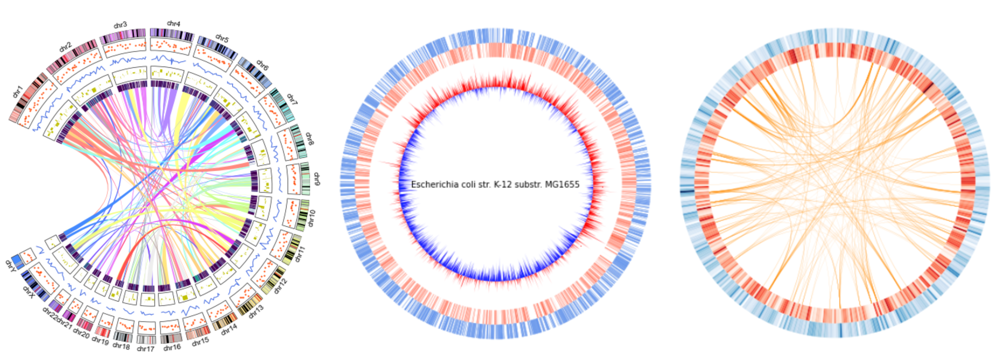

# pyCircos
Circos is one of the most popular software for visualizing genomic similarities and features. However, its execution process is complicated and requires multiple original config files for the visualizations. Additionally, Circos is written in Perl, which limits its integration with other software for biological analysis. On the other hand, Python has been applied for various biological software packages. Therefore, by combining these packages, researchers can complete most of the required analysis. Nevertheless, Python lacks a library for drawing Circos plots,  even though Circos software has been developed for more than a decade. Here, we provide a python Matplotlib based circular genome visualization package '"pyCircos." Users easily and quickly visualize genomic features and comparative genome analysis results by specifying annotated sequence files such as GenBank files. 

## Gallery


## Dependencies

- python 3.7later

## Installation

1. Download pyCircos package from the GitHub repository.   

   ```git clone https://github.com/ponnhide/pyCircos.git```

2. Move to pyCircos directory and Install pyCircos using the following command.  

   `python setup.py install` 

## Usage

pyCircos provides the “Gcircle class”  and "Garc class". A "Gcircle" class object  holds  the dictionary of Garc class objefcts and provides functions to place Garc classs object on the circular map. Each Garc class object manages numeric and genomic data to be visualized on the circular map.

### Gcircle class 

A Gcircle class object provides a circle whose diameter is 1000 (a.u.) as a drawing space. Any graph (line plot, scatter plot, barplot, heatmap, and chordplot) can be placed on the space by specifying the _raxis\_range_ (from 0 to 1000) and the corresponding Garc class object.

#### Parameters 

- **.garc_dict**: *dict* (default:None)
  Dictionary of the Garc class objects in *Gcircle object*. The keys of the dictionary are id values of the Garc class objects.

- .**figsize**: *tuple* (dfault:)
  Figure size for the circular map.

#### Methods

- **.add_garc (garc_object=*Garc class object*)**  
  Add a new Garc class object into *garc_dict*.
  - **garc_object**: *Garc class object* (default:None)  
    Garc class object to be added.
  
  **return** *None*
  
    
  
- **.set_garcs()**  
  Visualize the arc rectangles of the Garc class objects in *.garc_dict* on the drawing space. After the execution of this method, a new Garc class object cannot be added to *garc_dict* and *figure* parameter representing maplotlib.pyplot.figure object will be created in *Gcircle object*. 
  **return** *None* 

   

- __.lineplot (garc_id=*str*, data=*list* or *numpy.ndarray* , positions=*list* or *numpy.ndarray*, raxis_range=*tuple*, rlim=*tuple, linestyle=*str*, linecolor=*str* or *tuple*, linewidth=*int*)__  
  Plot a line in the sector corresponding to the arc of the Garc class object specified by *garc_id*. 

  - **garc_id**: *str* (defaut: *None*)  
    ID of the Garc class object. The ID shoud be in *Gcircle object.garc_dict*.
  - **data**: *list* or numpy.ndarray (default: *None*)  
    Numerical data to be drawn with line.
  - **positions**: *list* or *numpy.ndarray* (default: None)  
    The x coordinates of the values in *data* on the Garc class object when the plot is drawn on the rectangular coordinates. Each coordinate value should be in the range 0 to *size* of the Garc class object specified by *garc_id*. By the method execution, the coordinates are converted to proper angle coordinates. If *positions* are not given, proper coordinates values are generated according to the length of *data*. 
  - **raxis_range**: *tuple* *(top=int, bottom=int)* (default: (550, 650))   
    Radial axis range where line plot is drawn.
  - **rlim**: *tuple (top=int, bottom=int)* (default: (min(*data*), max(*data*)))  
    The *top* and *bottom* r limits in data coordinates. If *rlim* value is not given, the maximum value and the minimum value in *data* will be set to *top* and *bottom* , respectively.
  - **linestyle**: *str* (default: "solid")  
    Line style. Possible line styles can be reffered from https://matplotlib.org/stable/gallery/lines_bars_and_markers/linestyles.html
  - **linecolor**: *str or tuple* representing color code (default: None)  
    Color of the line plot. If *linecolor* value is not given, the color will be set according to the default color set of matplotlib. To specify the opasity for a line color, please use  (*r, g, b*, *a*) or #_XXXXXXXX_ format.
  - **linewidth**: *float* (default: 1)  
    Line width.

  **return** *None*


- **.fillplot (garc_id=*str*, data=*list* or *numpy.ndarray* , positions=*list* or *numpy.ndarray*, raxis_range=*tuple*, rlim=*tuple*, base_value=*float*, facecolor=*str* or *tuple*, linecolor=*str* or *tuple*, linewidth=*int*)**  
  Fill a specified area in the sector corresponding to the arc of the Garc class object specified by *garc_id*. 

  - **garc_id** :*str* (defaut: *None*)  
    Same parameter with *garc_id* of lineplot().  
  - **data**: *list* or numpy.ndarray (default: *None*)  
    Same parameter with *data* of lineplot().
  - **positions**: *list* or *numpy.ndarray* (default: None)  
    Same parameter with *positions* of lineplot().
  - **raxis_range**: *tuple* *(top=int, bottom=int)* (default: (550, 650))   
    Same parameter with *raxis_range* of lineplot().  
  - **rlim**: *tuple (top=int, bottom=int)* (default: (min(_data_), max(_data_))   
    Same parameter with *rlim* of lineplot().
  - **base_value**: *float* (default: 0)  
    Base line height in data coordinates. The area between the base line and the data line is filled by *facecolor*.
  - **facecolor**: *str or tuple* representing color code (default: None)  
    Color for filling.
  - **edgecolor**: *str or tuple* representing color code (default: "#303030")    
    Edge color of the filled area
  - **linewidth**: *float* (default: 0)  
    Edge line width.
  
  **return** *None*


- **.scatterplot (garc_id=*str*, data=*list* or *numpy.ndarray* , positions=*list* or *numpy.ndarray*, raxis_range=*tuple*, rlim=*tuple*, markershape=*str*, facecolor=*str* or *tuple*, edgecolor =*str* or *tuple*, linewidth=*int*, markersize=*int*)**  
  Plot markers in the sector corresponding to the arc of the Garc class object specified by *garc_id*.

  - **garc_id** :*str* (defaut: *None*)  
    Same parameter with *garc_id* of lineplot().
  - **data**: *list* or numpy.ndarray (default: *None*)  
    Numerical data to be drawn by scatter plots.
  - **positions**: *list* or *numpy.ndarray* (default: None)  
    Same parameter with *positions* of lineplot().
  - **raxis_range**: *tuple* *(top=int, bottom=int)* (default: (550, 650))   
    Same parameter with *raxis_range* of lineplot().
  - **rlim**: *tuple (top=int, bottom=int)* (default: (min(_data_), max(_data_))   
    Same parameter with *rlim* of lineplot().
  - **makershape**: *str* (default: "o")  
    Marker shape. Possible marker shapes can be reffered from https://matplotlib.org/stable/gallery/lines_bars_and_markers/marker_reference.html. 
  - **markersize**: *float* or *list* of *float* (default: *None*)  
    Size(s) of the marker(s).
  - **facecolor**:  *str, tuple* representing color code or *list* of color code (default: None)  
    Face color(s) of the markers. If value type is *list*, the lenght of *facecolor* should be the same as the data length.
  - **edgecolor**: *str or tuple* representing color code  (default: None)  
    Edge color of the markers
  - **linewidth**: *float* (default: 0)  
    Edge line width of the markers
  
  **return** *None*


- **.barplot (garc_id=*str*, data=*list* or *numpy.ndarray* , positions=*list* or *numpy.ndarray*, width=*float* or *list*, raxis_range=*tuple*, rlim=*tuple*, base_value=*int*, faceolor=*str* or *tuple*, edgecolor=*str* or *tuple*)** 

  Plot bars in the sector corresponding to the arc of the Garc class object specified by *garc_id*.

  - **garc_id** :*str* (defaut: *None*)  
    Same parameter with *garc_id* of lineplot().
  - **data**: *list* or numpy.ndarray (default: *None*)  
    Numerical data to be drawn by bar plots. 
  - **positions**: *list* or *numpy.ndarray* (default: _None_)  
    Same parameter with *positions* of lineplot(). The center of the base bases become in *positions*.
  - **width**: *float*  or *list* of *float* (default: *garc\_object.size/len(data)*)  
    Width(s) of the bars.
  - **raxis_range**: *tuple* *(top=int, bottom=int)* (default: (550, 650))   
    Same parameter with *raxis_range* of lineplot().
  - **rlim**: *tuple (top=int, bottom=int)* (default: (min(_data_), max(_data_))   
    Same parameter with *rlim* of lineplot().
  - **facecolor**: *str, tuple* representing color code or *list* of color code (default: None)   
    Facecolor(s) of the bars. If value type is *list*, the lenght of *facecolor* should be the same as the data length.
  - **edgecolor**: *str or tuple* representing color code  (default: _None_)   
    Edge color of the bars
  - **linewidth**: *float* (default: 1.0)  
    Edge line width of the bars.
  
  **return** *None*


- **.heatmap (garc_id=*str*, data=*list* or *numpy.ndarray*, positions=*list* or *numpy.ndarray*,  width=*float* or *list*,  raxis_range=*tuple*, cmap=*str*, vmin=*float*, vmax=*float*)**  
  Visualize magnitudes of data values by color scale in the sector corresponding to the arc of the Garc class object specified by *garc_id*.  
  
  - **garc_id** :*str* (defaut: *None*)  
    Same parameter with *garc_id* of lineplot().
  - **data**: *list* or numpy.ndarray (default: *None*)  
    Numerical data to be visualized by color scale. Two dimensional array can also be taken.
  - **positions**: *list* or *numpy.ndarray* (default: *None*)   
    Same parameter with *positions* of lineplot().
  - **width**: *float*  or *list* of *float* (default: *garc\_object.size/len(data)*)  
    Width(s) of the bars.
  - **raxis_range**: *tuple* *(top=int, bottom=int)* (default: (550, 650))   
    Same parameter with *raxis_range* of lineplot()
  - **cmap**: *str* represeting matplotlib colormap name or *matplotlib.colors.Colormap object* (default: "Reds")  
    The mapping from data values to color space.
  - **vmin**: *float* (default: min(data))  
    Minimum data limit for color scale.
  - **vmax**: *float*  (default: min(data))  
    Maximum data limit for color scale.

  **return** *None*

  
  
- **.chordplot(arc_loc1=*tuple*, arc_loc2=*tuple*, facecolor=*str* or *tuple*, edgecolor=*str* or *tuple*, linewidth=*int*)**
  Visualize inter-relation ships between data. 

  - **arc_loc1**: *tuple* (defaut: *None*)  
    First data location of linked data. The tuple is composed of four parameters: *arc_id*, *ede_position1*, *edge_position2*, *raxis_position*  
    *edge_position*1 and *edge_position2*  are the x coordinates on the Garc class object when the plot is drawn on the rectangular coordinates.  
    *raxis_position* is base height for the drawing cord.
  - **arc_loc2**: *tuple* (defaut: *None*)  
    Second data location of linked data. 
  - **facecolor**: *str or tuple* representing color code  (default: None)  
    Face color of the link.
  - **edgecolor**: *str or tuple* representing color code  (default: None)   
    Edge color of the link. 
  - **linewidth**: *float* (default: 0.0)  
    Edge line width of the link.
  
  **return** *None*
  
  
  
- .**featureplot (garc_id=*str*, feature_type=*str*, soruce=*list* of *Bio.SeqFeature object*, raxis_range=*tuple*, faceolor=*str* or *tuple*)**  
  Visualize sequence features with bar plots in the sector corresponding to the arc of the Garc class object specified by *garc_id*.

  - **garc_id** :*str* (defaut: *None*)  
    Same parameter with *garc_id* of lineplot().
  - **feature_type**: *str* (default: "all")  
    Biological nature of the Bio.Seqfeature class objects (Any value is acceptable, but GenBank format requires registering a biological nature category for each sequence feature).  
    If the value is "all",all features in *soruce* will be drawn in the sector of the Garc class object specified by *grac_id*.
  - **source**: *list* of *Bio.SeqFeature* object (default: record.features of the Garc class object specified by *grac_id* )  
    List of Bio.Seqfeature class object. If *source* value is not given, record.features of the Garc class object specified by *grac_id* is given.    
  - **raxis_range**: *tuple* *(top=int, bottom=int)* (default: (550, 650))   
    Same parameter with *raxis_range* of lineplot().
  - **facecolor**: *str or tuple* representing color code  (default: None)    
    Face color of the feature bars.
  
  **return** *None*


### Garc class

A Garc class object can be created by ```Garc()``` command.   
The following parameters, which are mainly used for the visualization of the arc rectangle, can also be specified. 

**Parameters**

- **arc_id**: *str* (default None)  
  Unique identifier for the Garc class object. Suppose *id* value is not given. An original unique ID is automatically given for *Garc object*. 
- **record**: *Bio.SeqRecord class object* or NCBI accession number (default: None)  
  Bio.SeqRecord class object or NCBI accession number of an annotated sequence. If a  NCBI accession number is given, the GeBank reord of the accesion number will be loaded from NCBI public database. 
- **size**: *float* (default: 1000)  
  Width of the arc rectangle. If *record* is given, the value is set by the sequence length of the record. The real arc rectangle width in the circle is determined by the ratio of *size* to the sum of the size and interspace values of the Garc class objects in the Gcircle class object. 
- **interspace**: *float* (default: 0)  
  Distance to the adjacent arc rectangle on the right. The real interspace size in the circle is determined by the ratio of *size* to the sum of the size and interspace values of the Garc class objects in the Gcircle class object. 
- **raxis_range**: *tuple* *(top=int, bottom=int)* (default: (500, 550))   
  Radial axis range where the arc rectangle is drawn.
- **facecolor**: *str* or *tuple* representing color code (default: *None*)  
  Face color for the arc rectangle. If *facecolor* is not given, the color will be selected from the default color set provided in the pyCircos module. 
- **edgecolor**: *str* or *tuple* representing color code (default: "#303030")  
  Edge color for the arc rectangle. If *edgecolor* is not given, the color will be selected from the default color set provided in the pyCircos module. 
- **linewidth**: *int* (default: 0)   
  Edge line width of the arc rectangle. 
- **label**: *str* (default: *arc_id*)  
  Label of the arc rectangle.  
- **labelposition**: *int* (default:0)  
  Relative label height from the center of the arc rectangle.  
- **labelsize**: *int* (default:0)  
  Font size of the label.
- **label_visible**: *bool* (defaule: *False*)  
  If True, *label* of the Garc object is shown on the arc rectangle.
  
  
#### Methods
The Garc class object provides some analytical methods to support users analyze genomic characters. 
- **.calc_density(positions=*list*, window_size=*int*)**  
  Converts *positions* consisting of x-coordinates into a list of density values scanned in a sliding window.
  - **positions**: *list* of *int* or *tuple*  
    List of x corrdinate values or tuple consisting of two x coordinate values. Each coordinate value should be in the range 0 to *size* of *Garc object*.
  - **window_size**: *int* (default:1000)   
    Size of the sliding window
  
  **return** *list* consisting of density values
  
- **.calc_nnratio(n1=*str*, n2=*str*, window_size=*int*, step_size=*int*)**  
  *n1* and *n2* are one of the nucleotide base letters of "ATGC". Calculate *n*,*m* ratiio for multiple windows along the sequence. If *Garc object.record* is None, the method will not work.
- .**calc_nnskew(n1=*str*, n2=*str*, window_size=*int*, step_size=*int*)**  
  *n1* and *n2* are one of the nucleotide base letters of "ATGC". Calculate *n*,*m* skew (n-m)/(n+m) for multiple windows along the sequence. If *Garc object.record* is None, the method will not work.

## Example code
Prease see the notebooks in the 'tutorial' directrory.
I also provides the executable tutorial codes in Google Colaboratory.
- tutorial1: https://colab.research.google.com/drive/1xmAnv7AHWUTA2HWfjqV1lFWkFMSLJHG0?usp=sharing
- tutorial2: https://colab.research.google.com/drive/1RYSo4aXpDIZlSQ9EhO2kPCeF8FOwyvXv?usp=sharing
- tutorial3: https://colab.research.google.com/drive/1EPxCQCgOouVxtXcGyxu2ZqQvfucVnOJ-?usp=sharing
