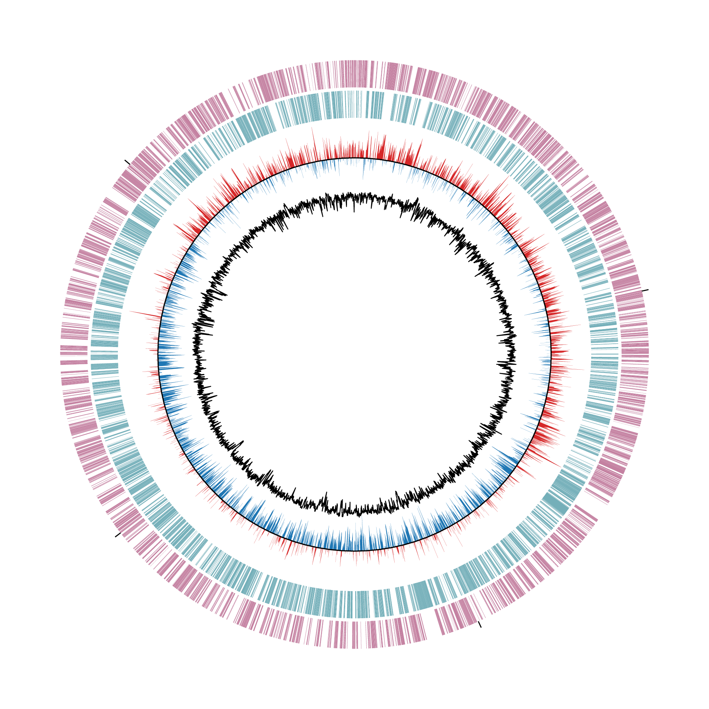
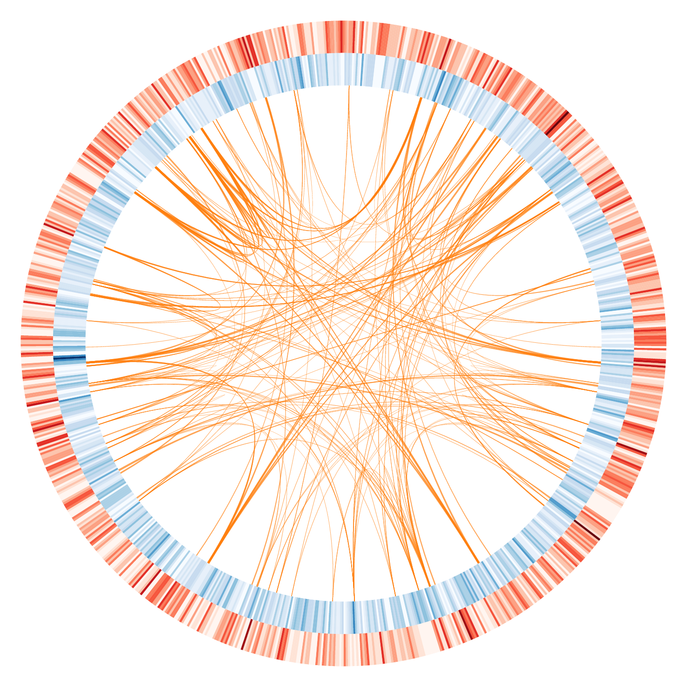

# Pycos

Circos is one of the most famous genome feature and similarity visualisation software. It is based on perl.  However, the execution requires so complicated process  and many extra argument files. At least, I cannot understand and execute the visualization processes. On the other hand, the file format for description of genome features have been organised. For examples, Fasta, GenBank, GFF have been used as general argument format for many genome and sequence analysis software. Here, I give python matplotlib based circular genome visualization package which is PyCircos (pseudonym). It enable to represent genome  features by only input of Genbank format file. By using comparative genome analysis result  by using BLAST or LAST, you can visualize multi genomic locus similarity easily with simple python script. 

### Dependencies

- python 2.7.13 or python 3.6.2 later
- matplotlib 2.0.0 later
- Biopython

### Usage

__Locus plot__ 

````python
import sys 
import matplotlib 
matplotlib.use("Agg")
import matplotlib.pyplot as plt 
from Bio import SeqIO
sys.path.append("../../")
import pycos as pycos

Set2  = plt.cm.Set2
Set2  = [Set2(i) for i in range(6)]
if __name__ == "__main__":
    record_parse = SeqIO.parse("","genbank")
    genome = pycos.GENOME()
    genome.read_locus(record_parse, interspace=0.02, bottom=800, height=80, requirement=lambda x: "NC_0032" in x, color_list=Set2)    
    genome.save()
````


__Feature plot__ 


__Example1__ Visualization of CDS, GC-skew and GC-amount from Genbank



__Example2__ Visualization of large repeat sequences in the  genome

1. Please prepare the self local alignment result  using BLAST or LAST or other software.

2. Please make a file like the following example from the above result.

   ````
   ID_name1	NC_XXXX1	1000	2000
   ID_name1	NC_XXXX1	8000	9000
   ID_name2	NC_XXXX1	1500	2700
   ID_name2	NC_XXXX2	1200	2400
   ````


__Example3__ Visualization of sequence duplication between chromosome.


