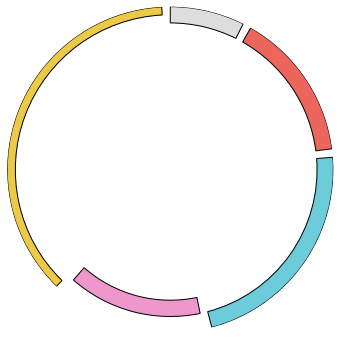
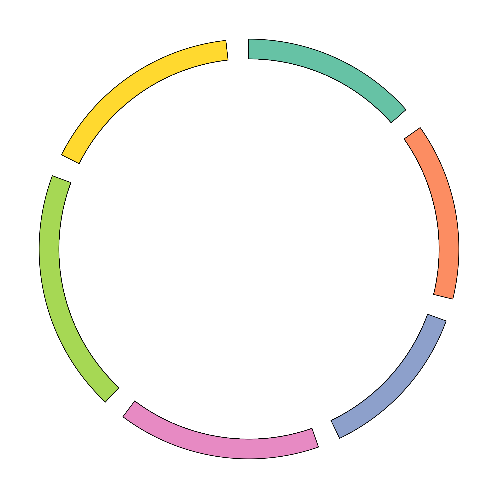

# pyCircos
Circos is one of the most famous genome feature and similarity visualisation software. It is based on perl.  However, the execution requires so complicated process  and many extra argument files. At least, I cannot understand and execute the visualization processes. On the other hand, the file format for description of genome features have been organised. For examples, Fasta, GenBank, GFF have been used as general argument format for many genome and sequence analysis software. Here, I give python matplotlib based circular genome visualization package which is PyCircos (pseudonym). It enable to represent genome  features by only input of Genbank format file. By using comparative genome analysis result  by using BLAST or LAST, you can visualize multi genomic locus similarity easily with simple python script. 

### Dependencies

- python 2.7.13 or python 3.6.2 later
- matplotlib 2.0.0 later
- Biopython

### Usage

__Example 0__  
(sample/locus_plot/how_to_use.ipynb)

````python
import sys 
import numpy as np
sys.path.append("../../")
from pycircos import *
#Set locus 
gcircle = Gcircle()
gcircle.add_locus("1", 1000, bottom=900, height=100) #name, length, bottom (0<=bottom<=1000), height (0<=bottom<=1000)
gcircle.add_locus("2", 2000, bottom=900, height=100, facecolor="#ED665D")
gcircle.add_locus("3", 3000, bottom=900, height=100, facecolor="#6DCCDA")
gcircle.add_locus("4", 2000, bottom=800, height=100, facecolor="#ED97CA")
gcircle.add_locus("5", 5000, bottom=950, height=50, facecolor="#EDC948")
gcircle.set_locus() #Creat figure object
gcircle.save() 
````


__Example 1__  
Visualization of CDS, GC-skew and GC-amount from Genbank (sample/prokayote1/prokaryote_1.ipynb)


__Example 2__  
Visualization of homology links in the genome (sample/prokayote2/prokaryote_2.ipynb)

